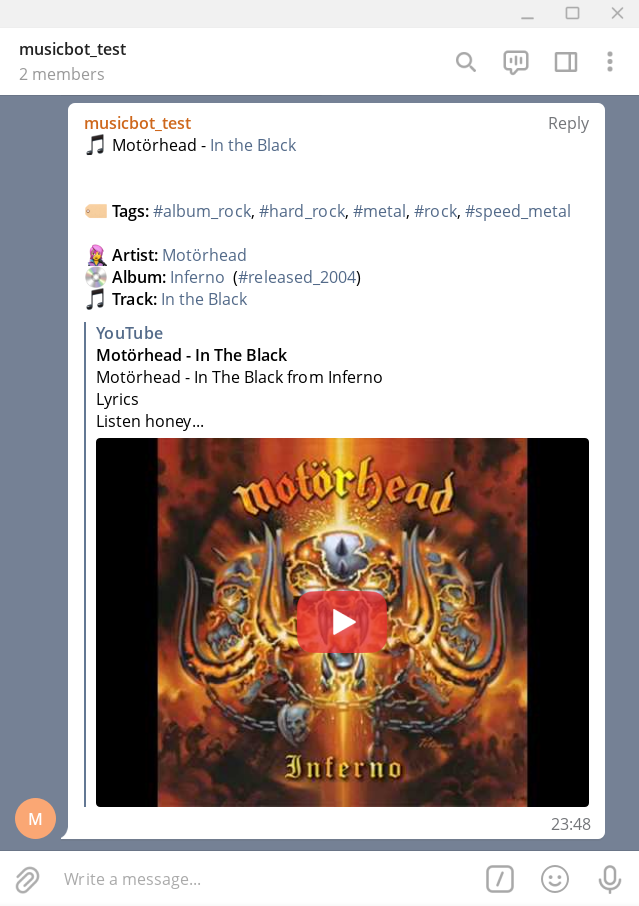
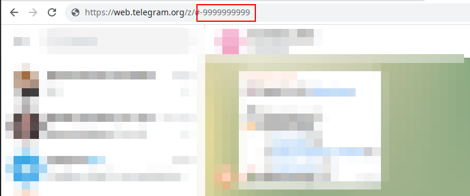

[](https://makeapullrequest.com)

# MusicBot 🎵 🤖

Telegram assistant for music-related groups.



# Installation

To get an instance up and running, first you need to copy `.env.template` into `.dev.env`
or `.prod.env` (depending on your needs), and fill the required environment variables:

1. Refer to the [@botfather](https://t.me/botfather) to register a bot. The `client id` and `secret`
   go into the `TELEGRAM_CLIENT_ID` and `TELEGRAM_CLIENT_SECRET` fields.
2. Go to the [spotify dev dashboard](https://developer.spotify.com/dashboard/applications) and
   register a new app. The `client id` and `secret` go into the fields `SPOTIPY_CLIENT_ID` and
   `SPOTIPY_CLIENT_SECRET`.
3. Get the `chat id` for the chat you want `musicbot` to work on. This can be done in telegram web,
   by heading into the chat you are interested in and looking into the browser's address bar. The
   10 digit number after the `#` is the chat id (it should be a negative number):

   

you can use `docker-compose`:

```
docker-compose up -d
```

It should automatically fetch all requirements and spin up the server.

# examples

These are some examples of URLs/URIs the bot can handle. They can serve as quick reference while
developing.

## Spotify URLs/URIs (track, album, artist)

```
!spotify:track:3T5th2QfWIZGot5RhBxvaT
!spotify:album:76TPO2Tro9Z2dihxaxmxtd
!spotify:artist:5YUQk45IjdzzQ49G1Txzkk
!https://open.spotify.com/track/0NE9QEMV1ljhNC8WB6UqYC
!https://open.spotify.com/album/2yCvEuVw81j9FEggmvSS5p
!https://open.spotify.com/artist/4tZwfgrHOc3mvqYlEYSvVi
```

## Youtube URLs (long, short)

```
!https://www.youtube.com/watch?v=ZIhwP0LVwgU
!https://youtu.be/UKaoWWC9COQ
```

## No YouTube metadata

```
!https://www.youtube.com/watch?v=7daW5KQZ8LE
```

## Wrong YouTube video found

No example of this at the moment.

```

```

## No Spotify track found

```
!https://www.youtube.com/watch?v=W7ZIz4w9Edo
```
