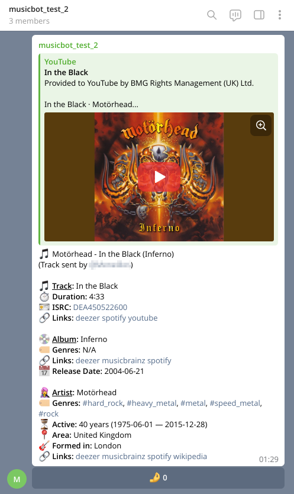
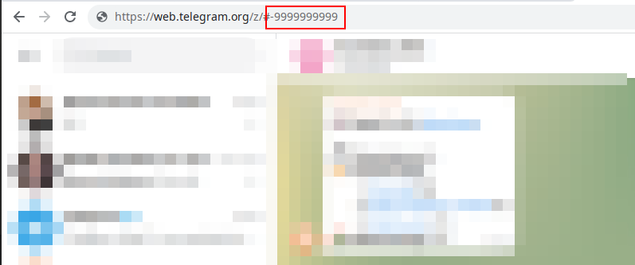

[](https://makeapullrequest.com)

# MusicBot 🎵 🤖

Telegram assistant for music-related groups.



## Installation

There is no package for now. To get an instance up and running, you need to clone the repository:

```bash
git clone https://github.com/javfg/musicbot.git
```

## Configuration

You need to copy `.env.template` into `.env` and fill the required environment variables:

> [!IMPORTANT]
> For links in digests to work, and generally because if the `chat_id` of the group ever changes you
> will lose all the scrobbles, it's recommended to convert the group to a supergroup before starting
> to use the bot. You can do this by following this steps:
> 1. Open the group chat and click/tap the group name to access settings.
> 2. Select "Manage" (settings icon) in the desktop app or "Edit" (pencil icon) in the mobile app.
> 3. Click/Tap "Group Type".
> 4. Choose "Public Group" and then type in an invite link.
> 5. Save the changes.
> After upgrading, you can revert the group to private; it will remain a supergroup.

1. Refer to the [@botfather](https://t.me/botfather) to register a bot. The token you get from that
   goes into the `MUSICBOT_BOT_TOKEN` env var.
2. Go to the [spotify dev dashboard](https://developer.spotify.com/dashboard/applications) and
   register a new app. The `client id` and `secret` go into the fields `MUSICBOT_SPOTIFY_CLIENT_ID`
   and `MUSICBOT_SPOTIFY_CLIENT_SECRET`.
3. Get the `chat_id` for the group you want to use the bot on. This goes into `MUSICBOT_CHAT_ID_WHITELIST`.
   You can add as many chat ids as you want, just separate them with commas. To get the `chat_id`, go
   to telegram web, head into the chat you are interested in and look into the browser's address bar.
   The 10 digit number after the `#` is the chat id (it should be a negative number):
   

## Running the bot

You can use `docker-compose`:

```
docker compose --env-file .env up -d
```


or `uv`:

```
uv run musicbot
```

Those should automatically fetch all requirements and spin up the bot.

### Development

For development, you can use watchfiles for hot-reloading, it is installed as a dev dependency:

```
uv sync --all-extras --dev
uv run watchfiles musicbot --filter=python
```


## Usage

Invoke the bot with `@bot_name`. Then type some song, album or artist name to trigger the search.
You can also use `/` commands. As soon as you type a slash, the bot will show you a list of available
commands.
